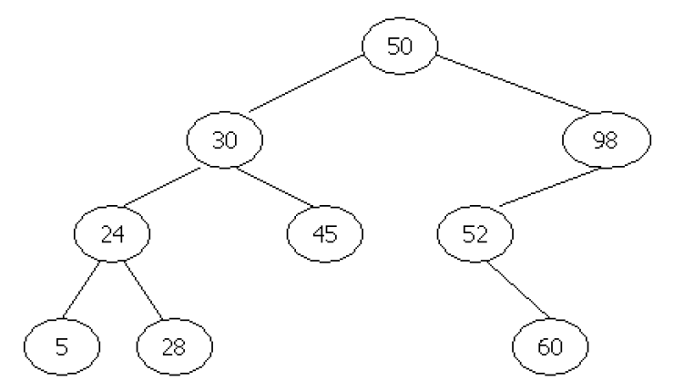

## Assignment 15 - Binary Search Tree

### Loic Konan

#### Description

>
> 
>
> - **Pre-order:** **50 30 24 5 28 45 98 52 60**  
> - **Post-order:** **5 28 24 45 30 60 52 98 50**  
>
> This program takes in a **pre ordered output** of a _binary search tree_ and then display the **post order output**.
>
> Implemented **2 version of the insert function** in order to see which one is **faster**:
>
> - **Recursive Version**
> - **Iterative Version**
>
### Files

|   #   | File                     | Description           |
| :---: | ------------------------ | --------------------- |
|   1   | [Banner](Banner)         | Banner for Assignment |
|   2   | [P12347.pdf](P12347.pdf) | The Problem           |
|   3   | [main.cpp](main.cpp)     | Solution              |
|   4   | [infile](infile)         | 1st sample file       |
|   5   | [infile2](infile2)       | 2nd sample file       |

### Instructions

- Complied using **VScode** and **C++ 17**
- main.exe < infile

### Sources

- <https://www.programiz.com/dsa/tree-traversal>
