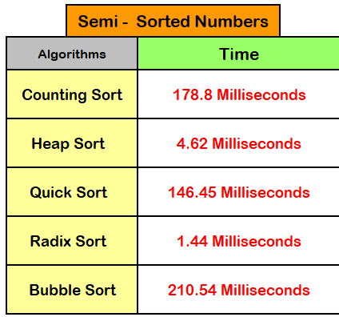
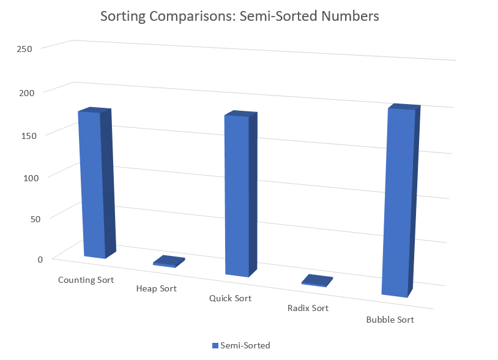

## Assignment 16 - Comparing Sorts

### Loic Konan

#### Description
>
> - This program is an **experiment to compare the sorting routines** by using these datasets
>
>   - **size**
>   - **type (integers, floats, strings)**
>   - **discombulation of data:**
>     - **completely unsorted or random**
>     - **partially unsorted (start with a sorted set and swap a percentage of the values)**
>     - **reverse sorted (sort into ascending order a set that is descending)**
>     _ **passed already sorted**
>
> - When we Compare the **Algorithm** with **Numbers** that are _**Semi-Sorted**_:
>
> 
> 
>

### Files

|   #   | File                           | Description           |
| :---: | ------------------------------ | --------------------- |
|   1   | [countSort.hpp](countSort.hpp) | Solution              |
|   2   | [countSort.out](countSort.out) | Count Sort program    |
|   3   | [driver.cpp](driver.cpp)       | Main function program |
|   4   | [genNums.py](genNums.py)       | Number Generator      |
|   5   | [heapSort.hpp](heapSort.hpp)   | Heap Sort program     |
|   6   | [heapSort.out](heapSort.out)   | Heap Sort program     |
|   7   | [quickSort.hpp](quickSort.hpp) | Quick Sort program    |
|   8   | [quickSort.out](quickSort.out) | Quick Sort Output     |
|   9   | [radixSort.hpp](radixSort.hpp) | Radix Sort program    |
|  10   | [radixSort.out](radixSort.out) | Radix Sort Output     |
|  11   | [rnums.dat](rnums.dat)         | Number data           |

### Instructions

- Complied using **VScode** and **C++ 17**
- main.exe < infile

### Sources

- <https://www.programiz.com/dsa/quick-sort>
- <https://www.programiz.com/dsa/counting-sort>
- <https://www.programiz.com/dsa/radix-sort>
- <https://www.programiz.com/dsa/bucket-sort>
- <https://www.programiz.com/dsa/heap-sort>
